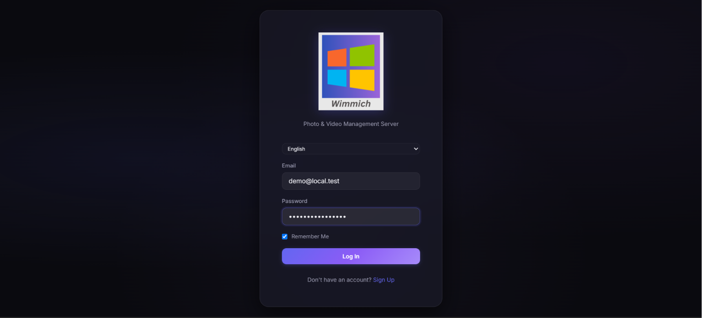
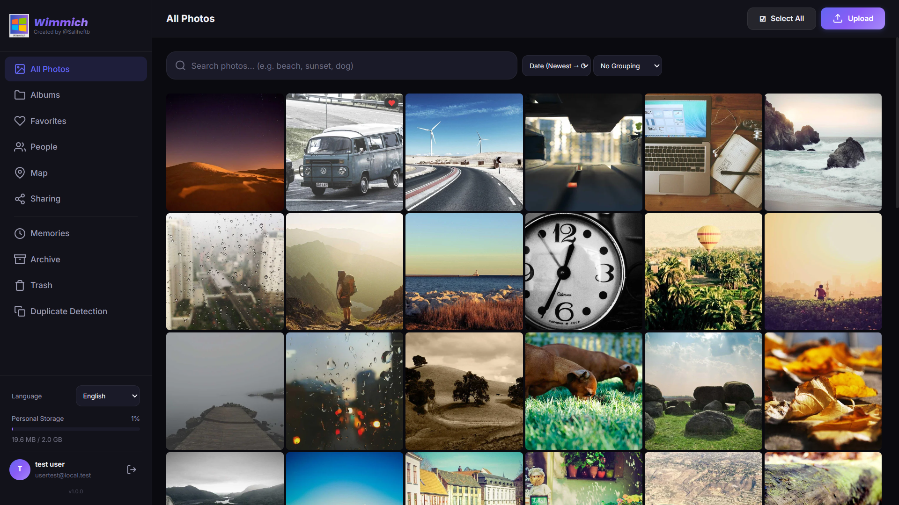
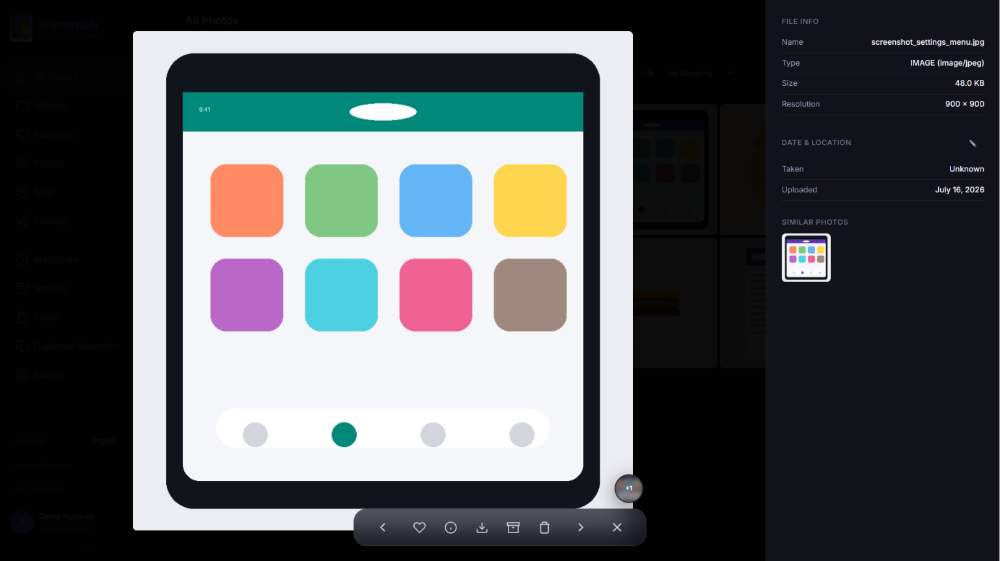
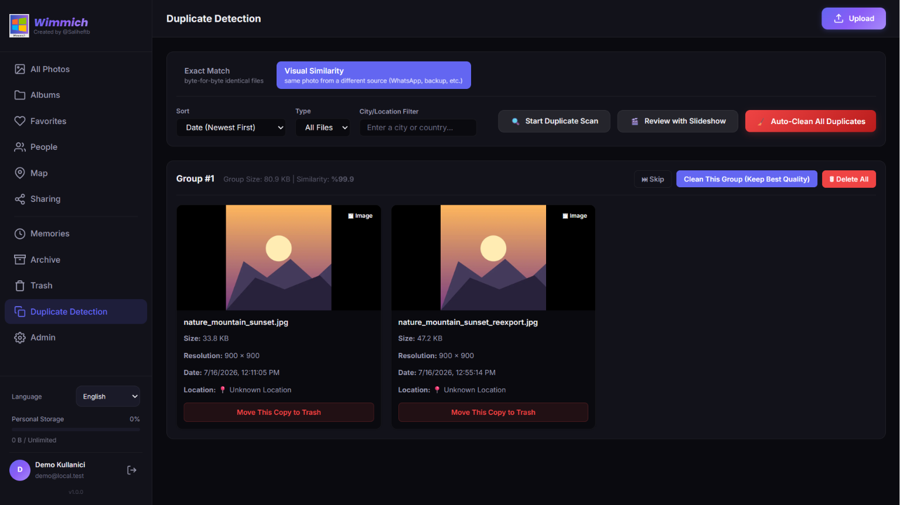
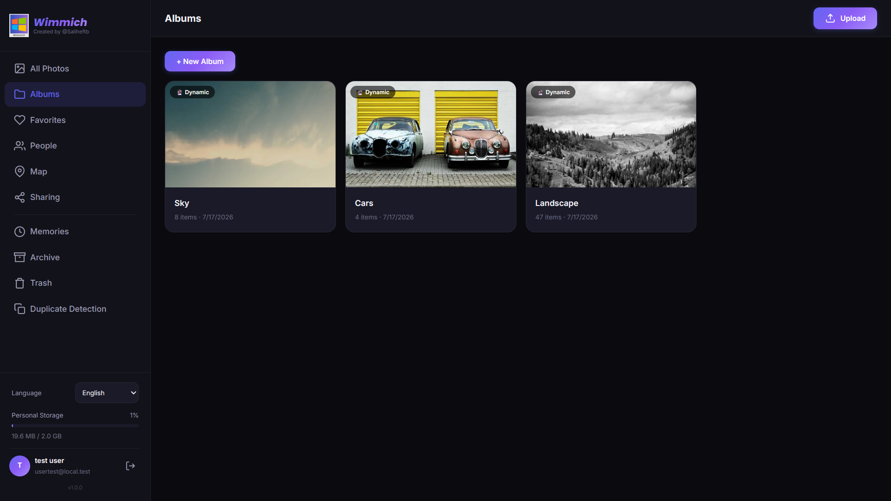
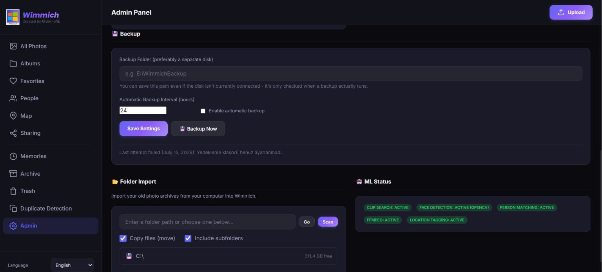
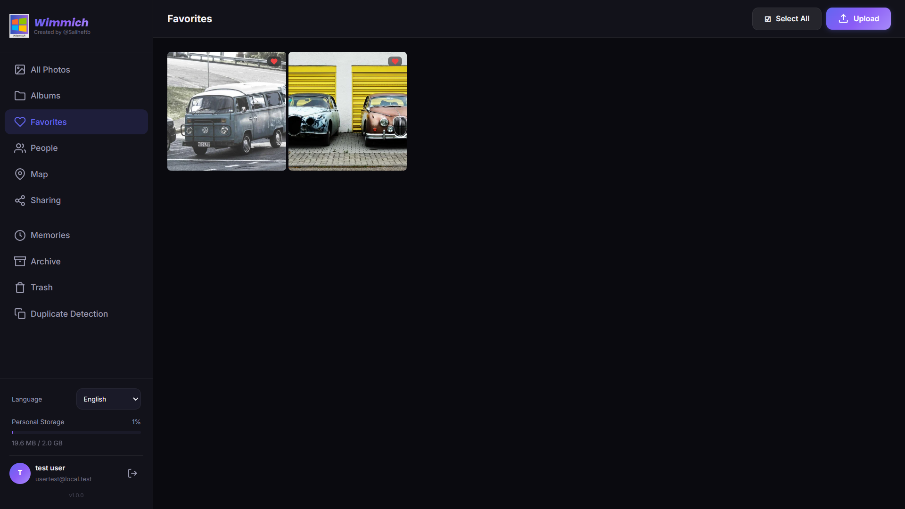
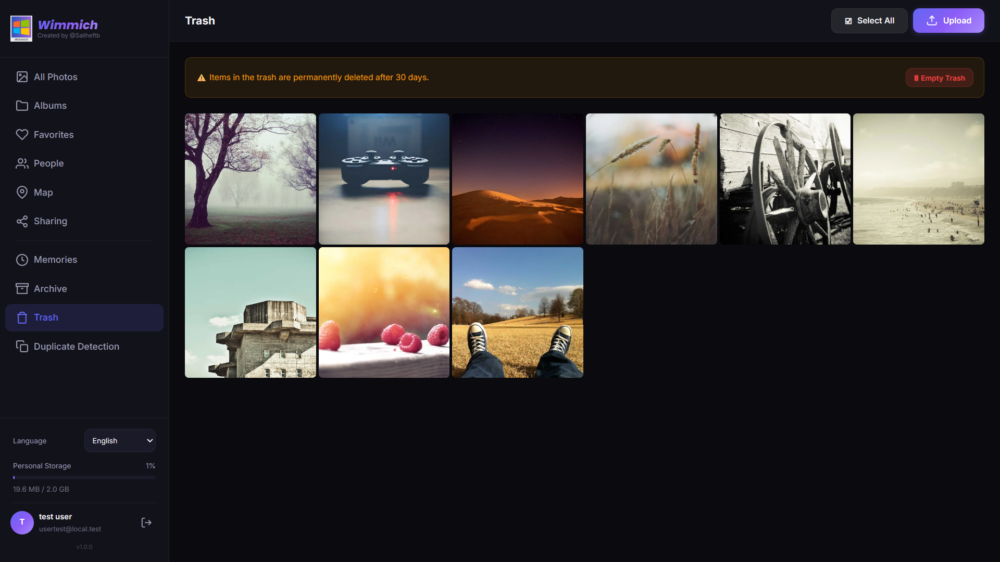

**[English](README.md) | [Türkçe](README.tr.md) | [Français](README.fr.md) | [Deutsch](README.de.md)**

# Wimmich

**Ein persönliches Foto- und Videoverwaltungssystem, das auf Ihrem eigenen Windows-Rechner läuft.**

Inspiriert von [Immich](https://github.com/immich-app/immich), von Grund auf neu geschrieben, um auf Ihrem eigenen Computer statt in der Cloud zu laufen (für alle Funktionen wird eine GPU mit 6-8 GB VRAM oder mehr empfohlen). Ihre Fotos verlassen niemals einen Server, den Sie nicht selbst kontrollieren.

---

## Warum dieses Projekt existiert

Für ein Familienarchiv, bei dem der Telefonspeicher ständig voll wird, sich dasselbe Foto aus sozialen Medien in Dutzenden Kopien ansammelt und man sich beim Suchen, wer auf welchem Foto zu sehen ist, in der Galerie verliert: eine Lösung, die kein Cloud-Abo braucht, Ihre Daten vollständig lokal hält und trotzdem bei "Cloud-Service"-Funktionen wie intelligenter Suche, Gesichtserkennung oder automatischer Kategorisierung keine Abstriche macht.

## Wichtigste Funktionen

### 🖼 Galerie

- Sortieren nach Datum/Name/Größe, Gruppieren nach Tag/Monat/Jahr/Typ — alles in einer einzigen "Alle Fotos"-Ansicht.
- **Gruppierung nach Jahr**: ein dichtes Mosaik, das Tausende von Fotos auf einen Blick zeigt.
- **Gruppierung nach Monat**: alle 12 Monate in einem vollständigen Kalenderrahmen; jeder Monat hat sein eigenes Mosaik, überzählige Fotos werden in einem "+N"-Badge zusammengefasst.

### 🔍 Intelligente Suche

- CLIP-basierte mehrsprachige semantische Suche — eine Phrase wie "Sonnenuntergang am Strand" findet passende Fotos, selbst wenn dieser genaue Ausdruck nirgends darin vorkommt.
- Das Suchfeld enthält auch alle Filter (ohne Album, nur Fotos/Videos, Favoriten, Archiv, intelligente Kategorien) — im Google-Stil, mit einer Vorschlagsliste, die sich beim Tippen verengt oder erweitert.
- Fotos werden automatisch in Kategorien einsortiert (Screenshot, Dokument, Natur, Haustier, Essen, Auto, Technik) — ganz ohne manuelles Taggen.

### 👤 Personen (Gesichtserkennung)

- GPU-beschleunigte Gesichtserkennung und automatische Gruppierung.
- Eine schnelle Benennungs-Warteschlange, die "Ist das X?" zur Bestätigung vorschlägt.
- Fehlzuordnungen manuell korrigieren: zusammenführen, trennen, aus einer Gruppe entfernen.

### 🧹 Duplikaterkennung

- **Exakte Übereinstimmung**: byte-genau identische Dateien (Checksum-basiert).
- **Visuelle Ähnlichkeit**: dasselbe Foto, erneut aus einer anderen Quelle gespeichert (WhatsApp, Cloud-Backup usw.) und neu komprimiert, aber visuell identisch — findet Duplikate, die Checksums nicht erkennen, mittels CLIP-Embedding-Ähnlichkeit.
- Wählt automatisch die beste Kopie aus (Auflösung → echte Standortdaten → Dateigröße, in dieser Reihenfolge).
- **Diashow-Modus**: Gruppen werden nacheinander mit Countdown präsentiert; läuft die Zeit ab, wird automatisch die beste Kopie behalten, oder Sie überspringen bzw. löschen die ganze Gruppe selbst.

### 🔗 Ähnliche Fotos

- Beim Öffnen eines Fotos erscheint ein Badge mit anderen, visuell ähnlichen Fotos — liest aus einer im Hintergrund vorberechneten Zuordnungstabelle, statt bei jedem Öffnen neu zu scannen.
- Dient rein zum Stöbern, ist kein Aufräum-Vorschlag.

### 💾 Backup

- Ein online-sicherer Schnappschuss der Datenbank plus noch nicht gesicherte Medien, gebündelt in einem einzigen, stark komprimierten Archiv.
- Backup-Speicherort und -Intervall sind konfigurierbar; lassen sich im Voraus einrichten, auch bevor die Zieldisk angeschlossen ist.

### 🗺 🔗 📁 ❤️ 🗄 🗑

Kartenansicht (Fotos mit Standort-Tags), Freigabelinks, Alben, Favoriten, Archiv und ein 30-tägiger Papierkorb.

### 🌐 Fernzugriff

Cloudflare-Tunnel-Integration für den Zugriff von außerhalb Ihres Heimnetzwerks — ohne Port-Weiterleitung oder statische IP.

### 🗣 Mehrsprachig

Oberfläche verfügbar in Englisch (Standard), Türkisch, Französisch und Deutsch. Beim ersten Start werden Sie nach der Sprache gefragt, die Sie jederzeit über die Seitenleiste ändern können.

---

## Screenshots

> Die folgenden Bilder stammen aus einem Demo-Konto, das ausschließlich zur Vorführung der Oberfläche erstellt wurde — sie enthalten keine echten Benutzerdaten.

| Anmeldung | Galerie |
|---|---|
|  |  |

| Fotobetrachter | Duplikaterkennung |
|---|---|
|  |  |

| Alben | Backup-Einstellungen |
|---|---|
|  |  |

| Favoriten | Papierkorb |
|---|---|
|  |  |

---

## Technische Voraussetzungen

- **Betriebssystem**: Windows 10/11 (läuft über `start.bat`, verwendet PowerShell).
- **Python**: 3.10+.
- **FFmpeg**: für Video-Thumbnails und Transcoding (optional — ohne läuft die Videounterstützung eingeschränkt).
- **GPU (empfohlen, nicht zwingend)**: CLIP-semantische Suche und Gesichtserkennung laufen mit installiertem CUDA deutlich schneller; ohne GPU sind diese beiden Funktionen deaktiviert, alles andere funktioniert normal.

### Optionale ML-Abhängigkeiten

Empfohlen: einfach `install_full.bat` ausführen — das Skript probiert bereits eine Kette aktueller CUDA-Build-Tags durch (mit automatischem Fallback, zuletzt auf CPU-only), da ein einzelnes fest eingetragenes Tag veraltet, sobald PyTorch es unter neueren Python-Versionen nicht mehr unterstützt. Manuelle Installation, falls nötig:

```
pip install torch torchvision --index-url https://download.pytorch.org/whl/cu130   # oder cu126 / cu121 — die vollständige Fallback-Kette steht in install_full.bat
pip install open_clip_torch transformers
pip install facenet-pytorch --no-deps
pip install requests scikit-learn
```

## Installation

### Schnellinstallation (empfohlen)

1. **[bootstrap.bat](https://github.com/SalihEfeTosunBayraktar/Wimmich/releases/latest/download/bootstrap.bat)** herunterladen und doppelklicken.
2. Windows SmartScreen zeigt wahrscheinlich „Windows hat Ihren PC geschützt" — das ist bei einem neuen, unsignierten Skript zu erwarten und kein Zeichen für ein Problem. Auf **Weitere Informationen** und dann **Trotzdem ausführen** klicken.
3. Der Browser öffnet eine Einrichtungsseite: Full/Minimal, ob eine NVIDIA-GPU vorhanden ist, ein Installationsordner und ein Port auswählen, dann auf **Install** klicken. Das Herunterladen von Wimmich, das Anlegen der Umgebung, die Installation der Abhängigkeiten und der Start des Servers laufen danach automatisch ab.

Kein git nötig, keine Eingabe in einem Terminal — `bootstrap.bat` lädt die Anwendung selbst herunter.

### Manuelle Installation

```
git clone https://github.com/SalihEfeTosunBayraktar/Wimmich.git
cd Wimmich
```

Dann eines der beiden fertigen Installationsskripte ausführen:

| Skript | Was installiert wird |
|---|---|
| `install_full.bat` | Alles — einschließlich CLIP-semantischer Suche und Gesichtserkennung (einige GB, mit GPU deutlich schneller). |
| `install_minimal.bat` | Alles außer den KI-Funktionen — kleinere, schnellere Installation. |

Nach der Installation den Server mit `start.bat` starten (`http://localhost:3000`). Der erste registrierte Benutzer wird automatisch Administrator. Ein erneuter Aufruf von `start.bat` startet den Server direkt, wenn das venv bereits existiert — der Installationsschritt wird nicht wiederholt.

## Technologie

- **Backend**: FastAPI (async), SQLAlchemy + aiosqlite, JWT-basierte Authentifizierung.
- **Frontend**: reines JavaScript (kein Framework), Single-Page-Anwendung.
- **ML**: LAIONs mehrsprachiges CLIP-Modell (ViT-H/14), facenet-pytorch (MTCNN + InceptionResnetV1) für Gesichtserkennung.
- **Speicherung**: Alle Daten (Fotos, Datenbank, Thumbnails) bleiben auf der lokalen Festplatte; es werden niemals Daten an einen Drittserver gesendet.

---

## Danksagung / Verwendete Open-Source-Projekte

Dieses Projekt wäre ohne die folgenden Open-Source-Projekte nicht möglich gewesen:

- **[Immich](https://github.com/immich-app/immich)** — die Inspiration für dieses Projekt.
- **[FastAPI](https://fastapi.tiangolo.com/)** & **[SQLAlchemy](https://www.sqlalchemy.org/)** — das Backend-Framework.
- **[OpenCLIP](https://github.com/mlfoundations/open_clip)** und **[LAION](https://laion.ai/)** — das CLIP-Modell für mehrsprachige semantische Suche (ViT-H/14, trainiert auf LAION-5B).
- **[facenet-pytorch](https://github.com/timesler/facenet-pytorch)** — Gesichtserkennung (MTCNN + InceptionResnetV1).
- **[PyTorch](https://pytorch.org/)** — das Fundament der gesamten ML-Infrastruktur.
- **[Pillow](https://python-pillow.org/)**, **[OpenCV](https://opencv.org/)**, **[rawpy](https://github.com/letmaik/rawpy)** — Bildverarbeitung und RAW-Dateiunterstützung.
- **[FFmpeg](https://ffmpeg.org/)** — Video-Thumbnails und Transcoding.
- **[Leaflet](https://leafletjs.com/)** — die Kartenansicht.
- **[reverse_geocoder](https://github.com/thampiman/reverse-geocoder)** — vollständig offline Standortauflösung, kein API-Key erforderlich.
- **[scikit-learn](https://scikit-learn.org/)** — Clustering (DBSCAN) für Duplikat-/Ähnliche-Fotos-Erkennung.
- **[Cloudflare Tunnel](https://www.cloudflare.com/products/tunnel/)** — Fernzugriff ohne Port-Weiterleitung.

---

## Lizenz

MIT — siehe [LICENSE](LICENSE).
