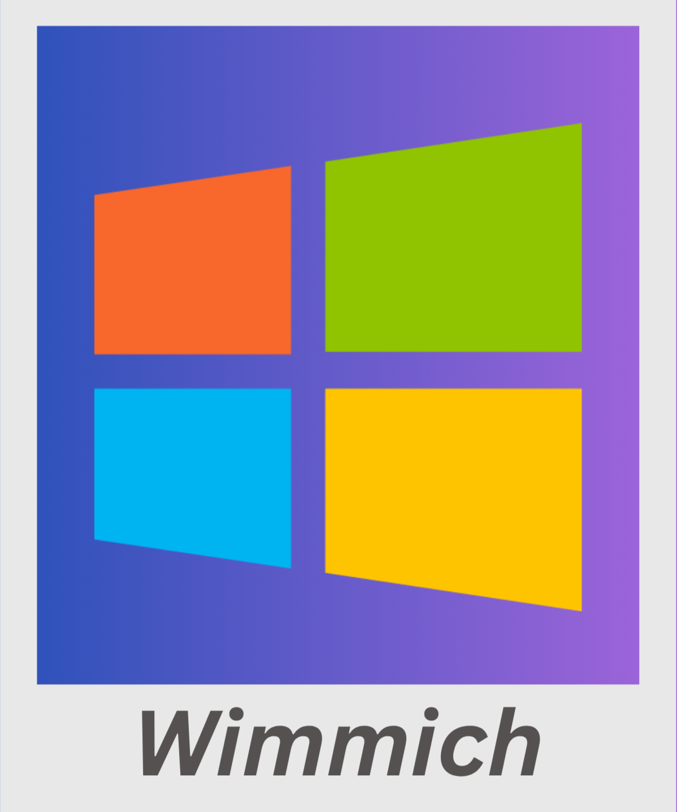

<p align="center">
  
</p>

**[English](README.md) | [Türkçe](README.tr.md) | [Français](README.fr.md) | [Deutsch](README.de.md)**

# Wimmich

**Un système personnel de gestion de photos et vidéos qui fonctionne sur votre propre machine Windows.**

Inspiré par [Immich](https://github.com/immich-app/immich), écrit de zéro pour fonctionner sur votre propre ordinateur plutôt que dans le cloud (un GPU avec 6 à 8 Go de VRAM ou plus est recommandé pour profiter de toutes les fonctionnalités). Vos photos ne quittent jamais un serveur que vous ne contrôlez pas.

---

## Pourquoi ce projet existe

Pour une archive familiale où la mémoire du téléphone se remplit sans cesse, où la même photo venue des réseaux sociaux s'accumule en dizaines de copies, et où retrouver qui figure sur quelle photo revient à se perdre dans la galerie : une solution qui ne nécessite aucun abonnement cloud, qui garde vos données entièrement en local, et qui ne fait aucune concession sur les fonctionnalités de type "service cloud" — recherche intelligente, reconnaissance faciale, catégorisation automatique.

## Fonctionnalités principales

### 🖼 Galerie

- Trier par date/nom/taille, regrouper par jour/mois/année/type — tout dans une seule vue "Toutes les photos".
- **Regroupement par année** : une mosaïque dense qui affiche des milliers de photos d'un seul coup d'œil.
- **Regroupement par mois** : les 12 mois disposés dans un calendrier complet ; chaque mois a sa propre mosaïque, les photos en trop étant repliées dans un badge "+N".

### 🔍 Recherche intelligente

- Recherche sémantique multilingue basée sur CLIP — une phrase comme "coucher de soleil à la plage" retrouve les photos correspondantes même si cette phrase exacte n'apparaît nulle part.
- La barre de recherche regroupe aussi tous les filtres (sans album, photos/vidéos uniquement, favoris, archive, catégories intelligentes) — à la Google, avec une liste de suggestions qui se réduit ou s'élargit au fil de la frappe.
- Les photos sont automatiquement classées par catégorie (capture d'écran, document, nature, animal, nourriture, voiture, technologie) — sans aucun étiquetage manuel.

### 👤 Personnes (Reconnaissance faciale)

- Détection de visages accélérée par GPU et regroupement automatique.
- Une file d'attente de nommage rapide qui suggère "Est-ce X ?" pour confirmation.
- Corrigez manuellement les erreurs : fusionner, séparer, retirer d'un groupe.

### 🧹 Détection des doublons

- **Correspondance exacte** : fichiers identiques octet par octet (basé sur un checksum).
- **Similarité visuelle** : la même photo réenregistrée depuis une autre source (WhatsApp, sauvegarde cloud, etc.) et recompressée, mais visuellement identique — repère les doublons que le checksum ne peut pas détecter, grâce à la similarité des embeddings CLIP.
- Sélectionne automatiquement la meilleure copie (résolution → données de localisation réelles → taille du fichier, dans cet ordre).
- **Mode diaporama** : les groupes défilent un par un avec un compte à rebours ; à la fin du délai, la meilleure copie est conservée automatiquement, ou vous pouvez passer au suivant ou supprimer tout le groupe vous-même.

### 🔗 Photos similaires

- Ouvrir une photo affiche un badge indiquant d'autres photos qui lui ressemblent visuellement — lit une table de correspondance précalculée en arrière-plan au lieu de rescanner à chaque ouverture.
- Purement pour naviguer, ce n'est pas une suggestion de nettoyage.

### 💾 Sauvegarde

- Un instantané sécurisé de la base de données en ligne, plus les médias pas encore sauvegardés regroupés dans une seule archive fortement compressée.
- L'emplacement et l'intervalle de sauvegarde sont configurables ; peuvent être définis à l'avance, même avant que le disque cible ne soit connecté.

### 🗺 🔗 📁 ❤️ 🗄 🗑

Vue carte (photos géolocalisées), liens de partage, albums, favoris, archive et une corbeille de 30 jours.

### 🌐 Accès à distance

Intégration Cloudflare Tunnel pour un accès depuis l'extérieur de votre réseau domestique — sans redirection de port ni IP statique.

### 🗣 Multilingue

Interface disponible en anglais (par défaut), turc, français et allemand. La langue est demandée au premier lancement, et peut être changée à tout moment depuis la barre latérale.

---

## Captures d'écran

> Les images ci-dessous proviennent d'un compte de démonstration créé uniquement pour présenter l'interface — elles ne contiennent aucune donnée utilisateur réelle.

| Connexion | Galerie |
|---|---|
|  |  |

| Visionneuse de photos | Détection des doublons |
|---|---|
|  |  |

| Albums | Paramètres de sauvegarde |
|---|---|
|  |  |

| Favoris | Corbeille |
|---|---|
|  |  |

---

## Prérequis techniques

- **OS** : Windows 10/11 (s'exécute via `start.bat`, utilise PowerShell).
- **Python** : 3.10+.
- **FFmpeg** : pour les miniatures vidéo et le transcodage (optionnel — le support vidéo est limité sans lui).
- **GPU (recommandé, non obligatoire)** : la recherche sémantique CLIP et la reconnaissance faciale sont bien plus rapides avec CUDA installé ; sans lui, ces deux fonctionnalités sont désactivées, tout le reste fonctionne normalement.

### Dépendances ML optionnelles

Recommandé : lancez simplement `install_full.bat` — il essaie déjà une chaîne de tags de build CUDA récents (avec repli automatique, puis vers CPU si aucun ne correspond), car un tag unique fixe devient obsolète dès que PyTorch cesse de le prendre en charge sous les nouvelles versions de Python. Installation manuelle, si nécessaire :

```
pip install torch torchvision --index-url https://download.pytorch.org/whl/cu130   # ou cu126 / cu121 — voir install_full.bat pour la chaîne de repli complète
pip install open_clip_torch transformers
pip install facenet-pytorch --no-deps
pip install requests scikit-learn
```

## Installation

### Installation rapide (recommandée)

1. Téléchargez **[bootstrap.bat](https://github.com/SalihEfeTosunBayraktar/Wimmich/releases/latest/download/bootstrap.bat)** et double-cliquez dessus.
2. Windows SmartScreen affichera probablement « Windows a protégé votre ordinateur » — c'est normal pour un script neuf et non signé, pas un signe de problème. Cliquez sur **Informations complémentaires**, puis **Exécuter quand même**.
3. Votre navigateur ouvre une page de configuration : choisissez Full/Minimal, si vous avez un GPU NVIDIA, un dossier d'installation et un port, puis cliquez sur **Install**. Le téléchargement de Wimmich, la création de l'environnement, l'installation des dépendances et le lancement du serveur se font ensuite automatiquement.

Pas besoin d'installer git ni de taper quoi que ce soit dans un terminal — `bootstrap.bat` télécharge l'application lui-même.

### Installation manuelle

```
git clone https://github.com/SalihEfeTosunBayraktar/Wimmich.git
cd Wimmich
```

Puis exécutez l'un des deux scripts d'installation prêts à l'emploi :

| Script | Ce qu'il installe |
|---|---|
| `install_full.bat` | Tout — y compris la recherche sémantique CLIP et la reconnaissance faciale (quelques Go, bien plus rapide avec un GPU). |
| `install_minimal.bat` | Tout sauf les fonctionnalités IA — une installation plus légère et plus rapide. |

Une fois installé, lancez le serveur avec `start.bat` (`http://localhost:3000`). Le premier utilisateur à s'inscrire devient automatiquement administrateur. Relancer `start.bat` démarre directement le serveur si le venv existe déjà — l'étape d'installation n'est pas répétée.

## Technologie

- **Backend** : FastAPI (async), SQLAlchemy + aiosqlite, authentification basée sur JWT.
- **Frontend** : JavaScript pur (sans framework), application monopage.
- **ML** : modèle CLIP multilingue de LAION (ViT-H/14), facenet-pytorch (MTCNN + InceptionResnetV1) pour la reconnaissance faciale.
- **Stockage** : toutes les données (photos, base de données, miniatures) restent sur le disque local ; rien n'est jamais envoyé à un serveur tiers.

---

## Remerciements / Projets open source utilisés

Ce projet n'aurait pas été possible sans les projets open source suivants :

- **[Immich](https://github.com/immich-app/immich)** — la source d'inspiration de ce projet.
- **[FastAPI](https://fastapi.tiangolo.com/)** & **[SQLAlchemy](https://www.sqlalchemy.org/)** — le framework backend.
- **[OpenCLIP](https://github.com/mlfoundations/open_clip)** et **[LAION](https://laion.ai/)** — le modèle CLIP pour la recherche sémantique multilingue (ViT-H/14, entraîné sur LAION-5B).
- **[facenet-pytorch](https://github.com/timesler/facenet-pytorch)** — détection et reconnaissance faciale (MTCNN + InceptionResnetV1).
- **[PyTorch](https://pytorch.org/)** — le socle de toute l'infrastructure ML.
- **[Pillow](https://python-pillow.org/)**, **[OpenCV](https://opencv.org/)**, **[rawpy](https://github.com/letmaik/rawpy)** — traitement d'image et support des fichiers RAW.
- **[FFmpeg](https://ffmpeg.org/)** — miniatures vidéo et transcodage.
- **[Leaflet](https://leafletjs.com/)** — la vue carte.
- **[reverse_geocoder](https://github.com/thampiman/reverse-geocoder)** — résolution de localisation entièrement hors ligne, sans clé API requise.
- **[scikit-learn](https://scikit-learn.org/)** — clustering (DBSCAN) pour la détection des doublons/photos similaires.
- **[Cloudflare Tunnel](https://www.cloudflare.com/products/tunnel/)** — accès à distance sans redirection de port.

---

## Licence

MIT — voir [LICENSE](LICENSE).
